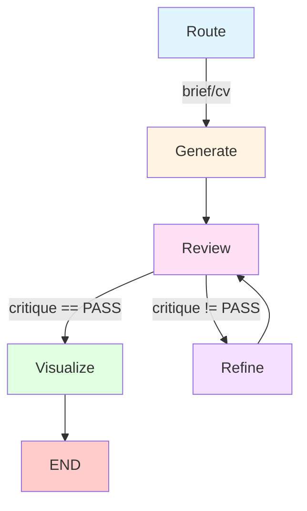
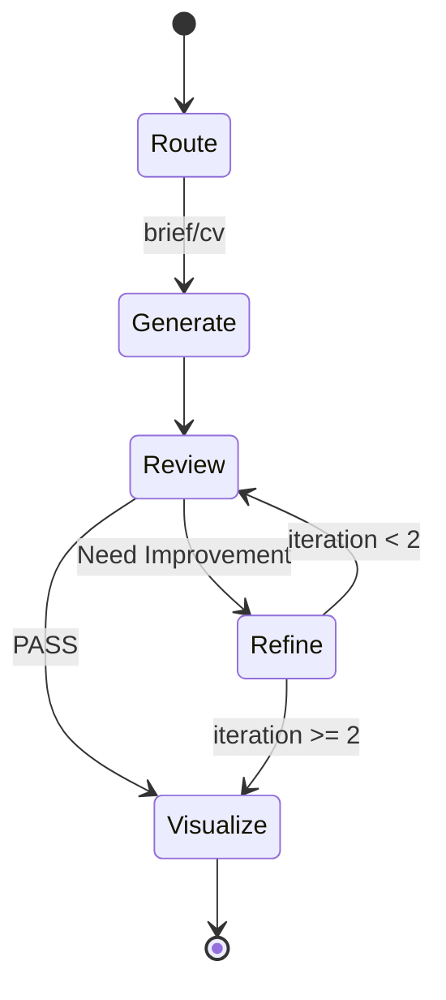

# Social-Media-Assistant

> 基于 LangGraph 的企业级多智能体内容生产流水线 | Enterprise-Grade Multi-Agent Content Production Pipeline

[](https://www.python.org/)
[](https://langchain-ai.github.io/langgraph/)
[](LICENSE)

## 📋 项目定位

**Social-Media-Assistant** 是一个基于 LangGraph 的企业级多智能体内容生产流水线，旨在通过 AI Agent 自动化生成高质量的社交媒体内容。项目支持多种内容类型（AI 行业简报、计算机视觉项目分析、学术论文总结），并具备自我纠错和视觉增强能力。

### 核心价值

- 🤖 **多智能体协作**：通过 LangGraph 实现复杂的 Agent 编排与状态管理
- 🔄 **自我纠错机制**：基于 Reflection 模式的内容质量保障
- 🎨 **多模态增强**：集成 fal.ai 实现文本到视觉的自动转换
- 🚀 **生产就绪**：完整的错误处理、日志追踪和模拟数据支持

---

## 🎯 核心突破

### 1. Reflection 模式：自我纠错闭环

本项目实现了基于 **Reflection 模式**的自我纠错机制，确保生成内容的质量：

```
Generate → Review → [Condition] → Refine → Visualize
           ↓
      Critique 反馈
           ↓
     [未通过] → 返回 Generate 重新生成
     [通过] → 进入 Visualize 生成配图
```

**技术实现**：
- **Reviewer Agent**：作为严谨的编辑，检查内容的专业性、AI 幻觉和配图描述质量
- **条件路由**：根据 `critique` 结果（'PASS' 或具体修改意见）动态决定工作流路径
- **迭代优化**：通过 `Annotated[int, operator.add]` 记录迭代次数，防止无限循环

**实际效果**：
- 自动检测并修正 AI 幻觉（虚假信息、不实描述）
- 确保内容专业性和逻辑完整性
- 通过多轮迭代达到质量标准

### 2. Multi-modal 视觉增强

集成 **fal.ai / Flux** 模型实现文本到视觉的自动转换：

- **智能配图生成**：根据生成的内容自动生成 4:3 比例的科技感配图
- **提示词优化**：从内容中提取关键信息，生成符合主题的视觉描述
- **无缝集成**：与 LangGraph 工作流无缝衔接，实现端到端的内容生产

---

## 🛠️ 技术路径

### 任务编排：LangGraph (Stateful Graph)

使用 **LangGraph** 构建状态化的工作流图，实现复杂的 Agent 编排：

```python
workflow = StateGraph(AgentState)
workflow.add_node("generate", generate_node)
workflow.add_node("review", reviewer_node)
workflow.add_conditional_edges("review", should_continue, {...})
```

**核心特性**：
- **状态管理**：使用 `TypedDict` 定义 `AgentState`，支持类型安全
- **条件路由**：根据状态动态决定工作流路径
- **状态合并**：通过 `Annotated[List[str], operator.add]` 实现状态的增量更新

### 逻辑推理：DeepSeek-V3/R1

使用 **DeepSeek-V3** 作为核心推理引擎：

- **多角色扮演**：AI 行业分析师、CV 专家、学术审稿人等
- **温度控制**：根据任务类型调整 temperature（严谨性任务使用 0.3，创意任务使用 0.7）
- **模拟模式**：支持在没有 API key 时使用模拟数据，便于开发和测试

### 实时感知：Tavily Search API

集成 **Tavily Search API** 实现实时信息获取：

- **智能搜索**：根据任务类型构建搜索查询
- **内容清洗**：自动提取和格式化搜索结果
- **错误回退**：API 失败时自动使用模拟数据，确保系统稳定性

### 视觉生成：fal.ai / Flux

使用 **fal.ai** 的 **Flux** 模型生成高质量配图：

- **模型**：`fal-ai/flux/schnell`（快速生成）
- **比例**：4:3 科技感配图
- **提示词工程**：从内容中提取关键信息，生成符合主题的视觉描述

---

## 🏗️ 架构设计

### 工作流架构图



### 状态流转



### 核心组件

```
social-media-assistant/
├── core/
│   ├── state.py          # AgentState 定义
│   └── graph.py          # LangGraph 工作流编排
├── agents/
│   ├── brief_agent.py    # AI 行业简报生成器
│   ├── cv_expert.py      # CV 项目分析专家
│   ├── reviewer.py       # 通用 Reviewer 节点
│   └── paper_agent/      # 论文分析 Agent（待启用）
├── tools/
│   ├── llm_engine.py     # DeepSeek-V3 引擎
│   ├── search.py         # Tavily 搜索工具
│   └── image_gen.py      # fal.ai 图片生成
└── main.py               # 统一入口
```

---

## 🚀 快速开始

### 环境要求

- Python 3.12+
- 依赖包见 `requirements.txt`

### 安装步骤

```bash
# 1. 克隆项目
git clone <your-repo-url>
cd social-media-assistant

# 2. 安装依赖
pip install -r requirements.txt

# 3. 配置环境变量
cp .env.example .env
# 编辑 .env 文件，填入以下 API Keys:
# DEEPSEEK_API_KEY=your_key_here
# TAVILY_API_KEY=your_key_here
# FAL_KEY=your_key_here
```

### 使用示例

```bash
# 生成 AI 行业简报
python main.py --type brief --input "AI tools"

# 分析 CV 项目
python main.py --type cv --input "object detection"

# 测试模式（无需 API keys，使用模拟数据）
python main.py --type brief --input "test"
```

---

## 📊 技术亮点

### 1. 类型安全的状态管理

```python
class AgentState(TypedDict):
    task_type: str
    input_query: str
    content: str
    image_url: str
    critique: str
    iteration: Annotated[int, add]  # 自动累加
    steps: Annotated[List[str], add]  # 自动合并
```

### 2. 智能错误处理

- **API 失败回退**：自动检测 API key 有效性，失败时使用模拟数据
- **异常捕获**：完整的错误处理和日志记录
- **优雅降级**：确保系统在任何情况下都能运行

### 3. 可扩展的 Agent 架构

- **模块化设计**：每个 Agent 独立实现，易于扩展
- **统一接口**：所有 Agent 遵循相同的状态接口
- **插件化工具**：搜索、LLM、图片生成工具可独立替换

---

## 🎓 开发者寄语

> 本项目不仅是自动化工具，更是对 **Agentic Workflow** 在社交媒体领域落地的工程化实践。

### 设计理念

1. **工程化优先**：注重代码质量、错误处理和可维护性
2. **用户体验**：支持模拟模式，降低使用门槛
3. **可扩展性**：模块化设计，易于添加新的 Agent 类型
4. **生产就绪**：完整的日志追踪和状态管理

### 技术选型思考

- **LangGraph**：选择状态化图而非简单链式调用，支持复杂的条件路由
- **DeepSeek-V3**：平衡性能与成本，支持多角色扮演
- **Reflection 模式**：通过自我审查提升内容质量，而非依赖单一生成
- **Multi-modal**：文本+视觉的完整内容生产，提升传播效果

### 未来方向

- [ ] 支持更多内容类型（视频脚本、播客大纲等）
- [ ] 集成更多视觉模型（Stable Diffusion、Midjourney 等）
- [ ] 实现 Agent 间的协作与通信
- [ ] 添加内容质量评估指标和 A/B 测试

---

## 📝 许可证

MIT License


---

**Built with ❤️ using LangGraph, DeepSeek-V3, and fal.ai**
